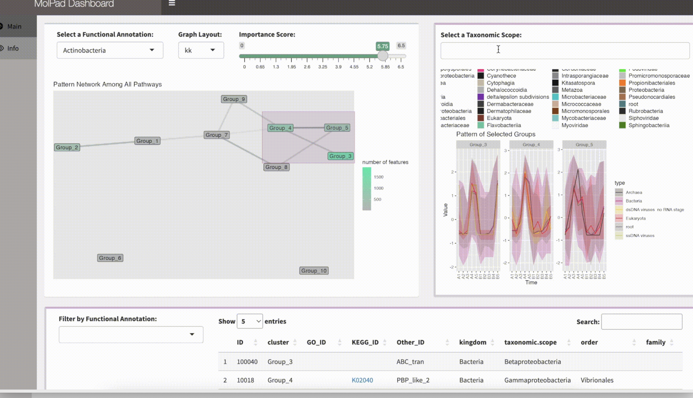
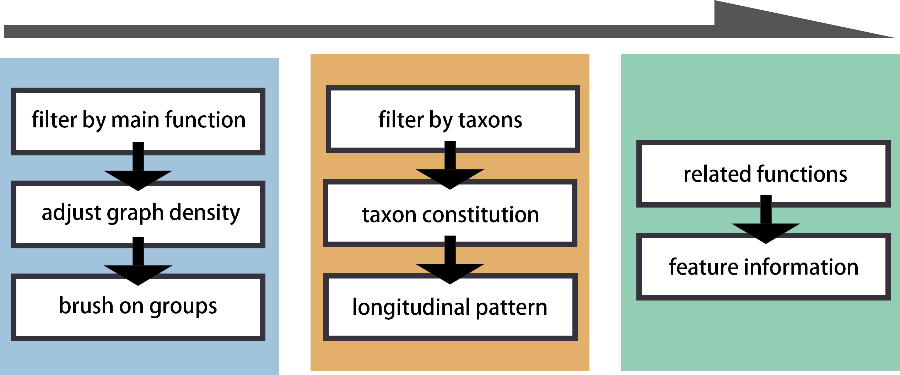

MolPad: Multi-Omics Longitudinal Pattern Dynamic Dashboard with Network
================
2023-05-31

## Overview

MolPad offers a visualization dashboard tool designed to enhance our understanding of how molecular co-expression works in the context of multi-omics microbiome data. The approach involves using a cluster network to provide an initial overview of relationships across multiple omics, with the added functionality to interactively zoom in on specific areas of interest. To facilitate this analysis, we've developed a focus-plus-context strategy that seamlessly connects to online curated annotations.

The dashboard itself comprises several components, including a cluster-level network, a bar plot illustrating taxonomic composition, a line plot displaying data modalities, and a table for each pathway. You can see an illustration of these features in this screenshot.

Additionally, our package simplifies the entire pipeline for creating the dashboard. This user-friendly design makes it accessible even to students with limited R programming experience.

## MolPad could help you with:  

1. Clutering the data with k-means and building a group network.
2. Find the significant trend patterns in your datasets.
3. Target the interaction between groups, taxons, and pathways.
4. Visualize the distribution of features in specific pathways on the group network.
5. Search for particular features and other user-defined labels.
6. Check detailed information on each feature through automatically generated hyperlinks.
7. Have a better overall understanding of the datasets.

## Workflow

The first input is a list of datasets, where each should have been normalized and imputed. The second input is a pathway dataset. 

Note that for all the datasets, the first column must be `ID`. For more information, please check the corresponding functions.