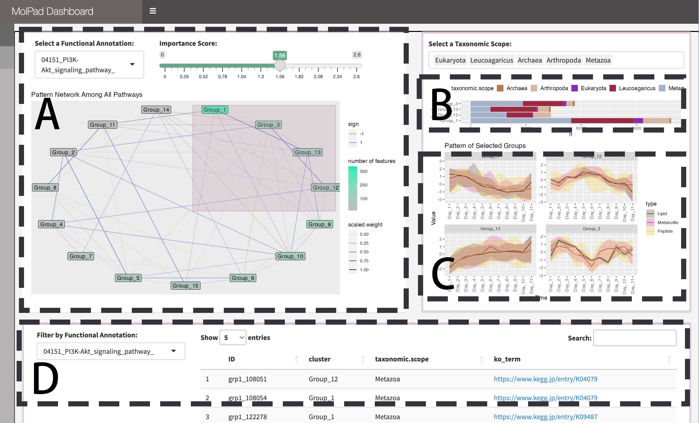

# Summary

The R-shiny package MolPad provides a visualization dashboard for understanding the dynamics of longitudinal molecular co-expression in microbiome multi-omics. The main idea for addressing the issue is to first use a network to overview major patterns among their predictive relationships and then zoom into specific clusters of interest. It is designed with a focus-plu-context analysis strategy and automatically generates links to online curated annotations. The dashboard consists of a cluster-level network, a bar plot of taxonomic composition, a line plot of data modalities, and a table for each pathway, as illustrated in Figure 1. Besides, we have the processing functions with the pipeline for generating the dashboard wrapped up in the package, so it is also beginner-friendly for students with less R programming experience. We will illustrate these methods with examples of two case studies:  a longitudinal, multi-platform meta-genomics analysis for cheese communities, and discovering the omics change over time in soil samples collected from the fungus-growing ants' garden.

# Statement of need

The realm of multi-omics is expanding rapidly, with numerous new studies and methodologies emerging. This highlights the need for visualizations that can account for differences across modalities. It’s also important to enable interpretations of dynamics and network structure because these have specific meanings in the genomic context. Another issue is the annotation. The special modality characteristic of multi-omics determines that each identical feature can be classified with various taxons and could have several IDs in different databases. Therefore, although the annotation is available online, it can be tedious to search for parts manually. Moreover, most present visualizations poorly evaluate longitudinal change across omics. In longitudinal data, we need to gain insight into the functioning of how individual features change and how they may influence related features. Thus, it depends upon analysis within one table and across tables. All of these have posed a challenge for unified visualization and interpretation. 

# Related Work

In response to the above issues, previous studies on multi-omics visualization tools have designed methods to work on complicated data. microViz\cite{microviz} provides a Shiny app for interactive exploration by pairing ordination plots and composition circular bar charts to show each taxon's prevalence and abundance. GWENA\cite{Lemoine_Scott-Boyer_Ambroise_Périn_Droit_2021} applies a network in conducting gene co‑expression analysis and extended module characterization in a single package to understand the underlying processes contributing to a disease or a phenotype. NeVOmics\cite{Zúñiga-León_Carrasco-Navarro_Fierro_2018} improved compatibility with a dynamic dashboard and facilitated the functional characterization of data from omics technologies. It also integrates Over-representation analysis methodology and network-based visualization to show the enrichment results. These methods suggest the mechanisms that improve the utility of multi-omics visualization tools under analysis.

# Data input

Our visualization pipeline starts with an optional pre-processing module with built-in functions. The raw input in our first case study includes three datasets collected from peptides, metabolites, and lipids. The package supports quantile normalization and KNN imputation to ensure library size effects and missing data are removed. The inputs are expected to be reformatted into a standard longitudinal data input format as in Table \ref{table:1}. One user-assigned type column will be taken as the category label to describe major groups in the data. It can be part of the annotation, as In the second case study, we used Kingdom as the type label column for cheese data. Note that the pre-processing is not a must, provided the matched format.

Besides the data type we mentioned above, our methods allow three levels of information: functional annotation, taxonomy annotation, and feature annotation. These will be matched with ID as columns in the annotation data, which is another input for generating a dashboard. We support KeggID, GOID, and PFAM for automatic feature link generation, and the users should set the corresponding column name beforehand. 

# Network Construction

To depict the longitudinal changes, we first cluster trajectories across all molecular features and then reorganize the clusters into a network graph. As in Fig \ref{fig:dashboard} part A, here, we scaled all the time series to extract only the changing patterns and apply K-means for ordination. We use a built-in elbow method to choose the optimal number of clusters. Then, we take the centers of each group and run a random forest regression for each group centroid with all the other centroids as predictors. We pick the top five predictors to build a cluster network with the Mean Decrease Accuracy as the feature importance. Based on the random forest prediction, if two groups of features are highly linked according to the network, then they will have strongly related longitudinal patterns, as shown in Fig \ref{fig:pattern}.

Navigating the network in the MolPad dashboard follows three steps as demonstrated in Fig \ref{fig:flow}: First, choose a primary functional annotation and adjust the edge density by tuning the threshold value on the importance score. Nodes that turnbright green (Fig \ref{fig:pattern}.A) represent clusters containing most features in the chosen functional annotation. Second, brushing on the network reveals patterns of taxonomic composition (Fig \ref{fig:pattern}.B) and typical trajectories  (Fig \ref{fig:pattern}.C). The user could also zoom into specific taxonomic annotations by filtering.
Third, view the feature table (Fig \ref{fig:pattern}.D) and examine the drop-down options for other related function annotations, and then click the link for online information on the interested items. The interface is designed to support iterative exploration, encouraging the use of several steps to answer specific questions, like comparing the pattern distribution between two functions or finding functionally important community members metabolizing a feature of interest. 

# Case Study: Cheese Data

Here we aim to highlight the versatility of the MolPad Dashboard with the illustration of the following example of washed-rind cheese communities. Unlike a multi-omics dataset, this data stands for a more general case that only includes single-omic measurements for the change of bacteria or Eukaryota in each cheese sample. Furthermore, it has multiple nested annotation labels ranging from kingdom to class, making it more flexible in interpretation. In this circumstance,  MolPad is able to present the clustered changing patterns with three different levels of granularity selected by the user, providing a dynamic overall perspective that can be drilled down at any time.

\paragraph{Background}

In the process of producing cheese, regular washing with a brine solution is an aging practice that can homogenize the microbial communities on the cheese' surface and facilitate intermicrobial interactions. This study analyzed a longitudinal data set of three washed-rind cheese communities collected during cheese ripening. 

\cite{doi:10.1128/msystems.00701-22}

\paragraph{Problem}
The study revealed a highly reproducible microbial succession in each cheese. In the bacterial community, Firmicutes are dominant at the very beginning, and Proteobacteria quickly take over the domination by the end of ripening. Besides, Cheese A and C show a reproducible establishment of Actinobacteria and Bacteroidetes separately. To verify the above conclusions with the MolPad dashboard, we analyzed two cheeses(A and C) from all three batches in week 2~13. 

\paragraph{Result}
In applying the dashboard, we made an extended time series by connecting the last time point of cheese A with the first one of cheese C. This allowed us to track unusual pattern combinations among different species and stages. The bacterial community is larger and has a higher variety of patterns, so we take the top four for detailed analysis. Groups 10 and 4 have decreasing trends for both cheeses, and they all include largely Proteobacteria and Firmicutes. While Groups 3 and 7 have the opposite increasing trends, which include more Actinobacteria and Bacteroidetes. Among these, Groups 7 and 4 have the strongest periodicity, suggesting a more reproducible tendency for the corresponding main components. For the eukaryote community, most of the features followed the same stable pattern as in Group 4. Overall, our results match the above research and could be used to provide intuitive explanations in supporting the findings.

{width=500}

