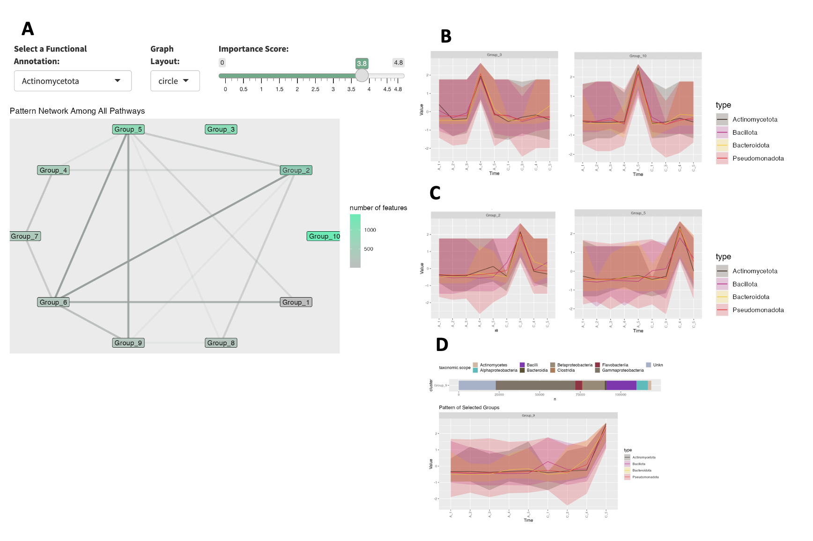

```{r, include = FALSE}
knitr::opts_chunk$set(
  collapse = TRUE,
  comment = "#>"
)
```

```{r setup}
library(MolPad)
library(dplyr)
```

# Introduction
This vignette provides a comprehensive guide on using MolPad for a case study, including data pre-processing, network generation, and result analysis.

# Washed-Rind Cheese Microbial Communities
Cheese making is an ancient craft that involves the coagulation of milk proteins to form curds, which are then separated from the liquid whey. The curds are processed, shaped, and aged to develop the desired texture and flavor. Various factors, such as the type of milk, specific cultures of bacteria, and aging conditions, contribute to the unique characteristics of each cheese. One crucial step in this process is the aging practice, where regular washing with a brine solution plays a significant role.

In the process of producing cheese, regular washing with a brine solution is an aging practice that can homogenize the microbial communities on the cheese' surface and facilitate intermicrobial interactions. In the following parts, we will analyze a longitudinal data set of three washed-rind cheese communities collected during cheese ripening.

# Data
For the analysis, we use a data set contained in the study by Smith et al. (2022) on [microbial communities in cheese](https://journals.asm.org/doi/10.1128/msystems.00701-22). The original research investigated the successional dynamics that occur within cheese rind microbial communities using a combination of 16S rRNA amplicon, Illumina, and PacBio sequencing. We functionally and taxonomically annotate (using eggNOG (21) and MMseqs2 (22)) the contigs they have generated from the Illumina reads, to demonstrate the utility of MolPad using a single-omic. Specifically, we focus on Cheese Sample A and Cheese Sample C. For more detailed information on our attached data, please check [this documentation](https://kaiyanm.github.io/MolPad/reference/cheese.html).

```{r}
data("cheese")
str(cheese)
str(annotations)
```

## Pre-process
### Data and Annotations
Here we select a 'type' column with `phylum` to describe the characteristic of cheese data. Also, the columns `phylum` and `class` are taken as tags for elemental composition.

In this section, we will introduce data preparing steps for analysis. The annotations dataset contains various columns that describe the characteristics and properties of samples. First, we select the 'type' column with `phylum` to provide a broad categorization of the microbial communities present on the cheese surface. This categorization helps in understanding the overall composition and diversity of microbes at a high taxonomic level. Then we run the `pre_process()` function to clean and standardize the data.

```{r}
cheesedata <- cheese |> 
   		 select(ID, A_1:C_5, phylum) |> 
   		 rename(type=phylum) |> 
      		pre_process()
```

To further annotate the dataset, we also use the columns `phylum` and `class` as tags for the elemental composition of the microbial communities. The `phylum` column represents a major taxonomic rank, giving us a broad overview of the microbial distribution. The `class` column provides more detailed information, allowing us to delve deeper into the specific types of microbes present.

```{r}
pathchee <- gAnnotation(annotations,"phylum","class")
```


After pre-processing, here is what the two datasets that we will put into the dashboard look like:
```{r}
# data
cheesedata[112:115,]
# annotation
pathchee[112:115,]
```


## Cluster Input

In this section, we generate clusters from the first dataset above using the `gClusters` function. This function takes the cheese dataset (`cheesedata`) as input and generates clusters based on specified parameters. Here, we set the number of clusters to 10 (`ncluster = 10`) and specify the maximum number of clusters to consider for determining the optimal number of clusters (`elbow.max=15`).

```{r}
cluschee <- gClusters(cheesedata,ncluster = 10,elbow.max=15)
```

## network input
After generating the clusters for major patterns, we proceed to obtain network results from the clusters. Taking the cluster centroids as the nodes, the prediction process for edges is divided into individual regression tasks, where each cluster centroid is independentally predicted from the expression of all the other cluster centroids, using random forests. We pick the top 3 related predictors for each cluster centroid and save the network output for future use. This is achieved using the `gNetwork()` function.

```{r}
networkchee <- gNetwork(cluschee,ntop = 3)
```

To gain more insight into the network results, we can visualize the details using the `gNetwork_view()` function, as shown below.

```{r,fig.height=9, fig.width=5}
gNetwork_view(networkchee)
```

# Run Dashboard
Once the clusters and network results are obtained, we can proceed to run the dashboard. This involves declaring the annotations and then executing the dashboard using the `gDashboard()` function. Here, we pass the cheese dataset (cheesedata), cluster results (cluschee), network results (networkchee), and specify column names and types for annotation identifiers.

```{r,eval=FALSE}
gDashboard(cheesedata,
           cluschee,
           pathchee,
           networkchee,
           id_colname = c("GO_ID","KEGG_ID"),
           id_type = c("GO","KEGG"))
```

# Results

For example, when we filter for Actinomycetota (Actinobacteria) as the functional group, we see that there are no edges connecting to group 10 and group 3- the clusters that have the most features associated with Actinomycetoa for Cheese sample A (Fig 1.3.A). 

<center>
  
  { width=100% }
  *Fig 1: Dashboard showing Actinomycetota filtered network (A) with enrichment pattern for Cheese Sample-A (B) and Cheese Sample-C (C); Cluster pattern for Group 9, which also is enriched for Type IV secretion genes (D).*
  
</center>

Looking at the pattern traces of these groups, (Fig 1.3.B), there is a peak in samples A4 (week 9) and A5 (week 13), which mirrors the 16S rRNA results of Saak et al. Since these two clusters do not have edges connecting them to other groups, this suggests that the Actinomycetoa features found in these groups follow distinct longitudinal succession patterns that are independent. When looking at Actinomycetoa within Cheese Sample C we see a different pattern. Groups 2 and 5, have the most features associated with Actinomycetoa, but they are highly connected to the other groups (Fig 1.3.A). From these results, we can hypothesize that though Actinomycetoa features are more abundant in later time points for both cheese samples, their dynamics are differentially influenced. 

The authors found that Type VI secretion was enriched in Pseudomonadota bacteria (specifically, Psychrobacter), and hypothesized this enrichment was due to the importance of physical species interactions that occur with this habitat. Using MolPad, we searched for other secretion systems associated genes, to understand their dynamics within the community. Focusing on KEGG annotated Type IV secretion genes, we found that Group 9 contained 12/13 of these genes. Within this group, features that cluster are ones that peak in Cheese sample C5 (week 13, Fig 1.3.D). This is also the most taxonomically diverse sample. From this, we can hypothesize that increased taxonomic diversity is also associated with increases in genes that are related to competitive species interactions. 