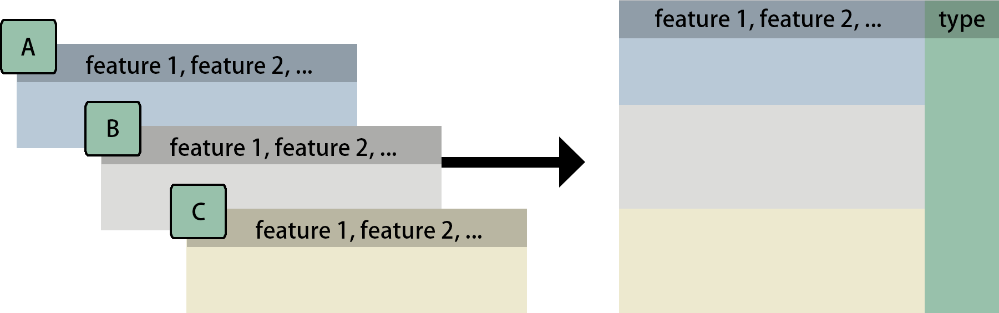

```{r, include = FALSE}
knitr::opts_chunk$set(
  collapse = TRUE,
  comment = "#>"
)
```

```{r setup, include = FALSE}
library(MolPad)
library(dplyr)
```

# Installation

You can either install MolPad with `devtools`,
```{r, eval = FALSE}
# Install the package in R:
install.packages("devtools")
library(devtools)
install_github("KaiyanM/MolPad")
```
or clone this repository to your local computer (for example, onto `./Github`) for installing:
```{r, eval = FALSE}
# Download through Github and install the package in R:
setwd("./GitHub")
install("MolPad")
```
after that, load the package:
```{r,eval=FALSE}
library(MolPad)
```

# Key features

### Trajectory clustering

By organizing data into clusters, it helps identify patterns, relationships, and underlying structures within a dataset. In essence, clustering detects groups of features or observations that behave similarly, allowing for deeper insights and more effective decision-making. 

### Network extracting

We build network between clustered trajectories by adapting the GENIE3 algorithm. Specifically, the network is learned through a series of regressions, where each cluster centroid is predicted from the expression patterns of all the other cluster centroids using random forests. We choose random forests because of their potential to model interacting features and non-linearity without strong assumptions. 

### Interactive Dashboard

This package provides an interactive dashboard designed to help users explore data and uncover relationships within complex networks. By utilizing focus-plus-context visualization, the dashboard allows users to zoom in on specific details while keeping the broader dataset in view. This approach enables a deeper understanding of the data, making it easier to identify patterns and make informed decisions. 

```{r, include = FALSE}
load("/Users/hazelma/multiomics_simulate.RData")
fungal_dlist[[1]]

```

# Data Input

Our visualization pipeline begins with an optional pre-processing module that offers built-in functions to streamline data preparation. 

Depending on the nature of your datasets, there are two primary conditions to consider:

## If Your Datasets are Multi-Omics:

In this scenario, we assume that you provide a list of data tables, each collected for a different omics type. For example, you might have datasets for peptides, metabolites, and lipids. We recommend carefully reviewing your data and considering applying quantile normalization and KNN imputation to address issues related to library size and missing data.

To achieve this, simply run the pre_process() function, which will yield the standard input format as demonstrated below.

```{r}
data <- pre_process(fungal_dlist, typenameList = c('DataSource_A','DataSource_B','DataSource_C'), replaceNA = TRUE,
                        scale = TRUE, autoColName = "Section_")
```


```{r}
head(data)
```

<div align="center">
  
  { width=70% }


```{r}

```


```{r, echo=FALSE}
# Simulated data with the standard input format 
x <- data.frame("ID"=1:5,"Day_1"=rnorm(5),"Day_2"=rnorm(5),"Day_3"=rnorm(5),"Day_4"=rnorm(5),"Day_5"=rnorm(5),"Day_6"=rnorm(5),"Day_7"=rnorm(5),"Day_8"=rnorm(5),"type"=c(rep("peptide",3),"lipid","metabolite"))
x
```


## If Your Datasets are NOT Multi-Omics:

You can still utilize our dashboard by ensuring that your data inputs are reformatted into the standard longitudinal format. While the datasets may not be multi-omics, you can manually assign the type column with any category label to describe major groups in the data. In our case study, we utilized "Kingdom" as the type label column for the cheese data.


## Choose Your Annotation

In addition to specifying the data type mentioned above, our methods support three levels of information: functional annotation, taxonomy annotation, and feature annotation. These annotations will be matched with ID columns in the annotation data, serving as another crucial input for generating the dashboard. We facilitate automatic feature link generation using KeggID and GOID, for which users should set the corresponding column names beforehand.

# Network Navigation

To effectively navigate the dashboard generated by MolPad, you'll follow three main steps:

## 1. Choose a Primary Functional Annotation and Adjust Edge Density
Start by selecting a primary functional annotation from the available options. Then, fine-tune the edge density by adjusting the threshold value on the importance score. Nodes that turn bright green indicate clusters containing the most features related to the chosen functional annotation.

## 2. Explore the Network
Brushing on the network unveils patterns of taxonomic composition and typical trajectories. You can also zoom into specific taxonomic annotations by applying filters.

## 3. Investigate Feature Details and Related Function Annotations
Delve into the feature table to examine the specifics of the features within the selected clusters. Explore additional related function annotations using the drop-down options. Click on the provided links to access online information about the items of interest. The interface encourages iterative exploration, enabling you to conduct multiple steps to answer specific questions, such as comparing pattern distributions between two functions or identifying functionally important community members metabolizing a feature of interest.

<div align="center">
  
  { width=70% }
