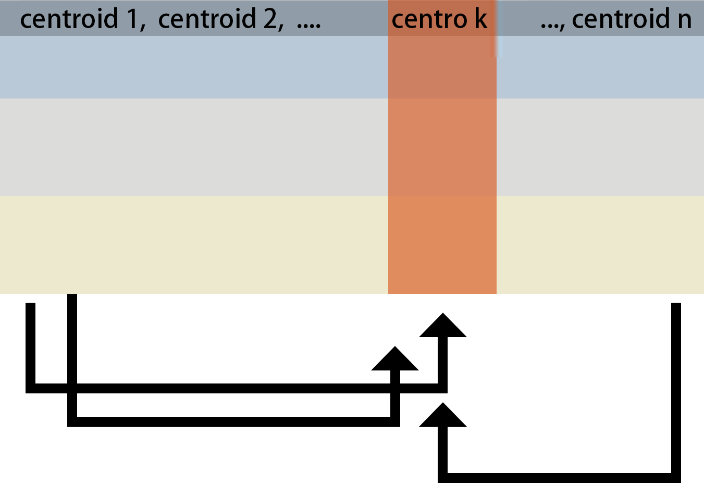
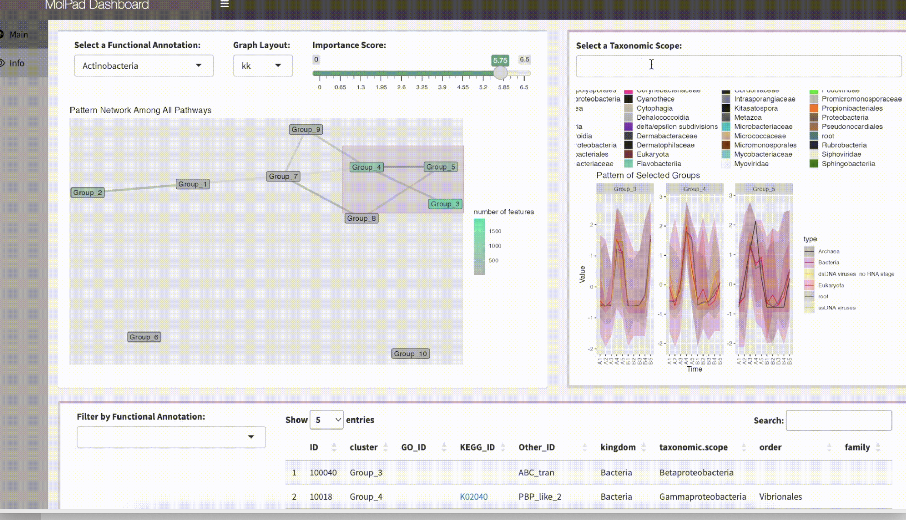

```{r, include = FALSE}
knitr::opts_chunk$set(
  collapse = TRUE,
  comment = "#>"
)
```

```{r setup, include = FALSE}
library(MolPad)
library(dplyr)
```

# Installation

You can either install MolPad with `devtools`,
```{r, eval = FALSE}
# Install the package in R:
install.packages("devtools")
library(devtools)
install_github("KaiyanM/MolPad")
```
or clone this repository to your local computer (for example, onto `./Github`) for installing:
```{r, eval = FALSE}
# Download through Github and install the package in R:
setwd("./GitHub")
install("MolPad")
```
after that, load the package:
```{r,eval=FALSE}
library(MolPad)
```


```{r, include = FALSE}
load("/Users/hazelma/Documents/GitHub/MolPad_Data/multiomics_simulate.RData")
```

<br />

# Before Input

We recommend carefully reviewing your data and considering applying normalization (standardization, quantile normalization, log transformation, ...) and imputation (KNN, PMM,  Mean/Median/Mode, ...) to address issues related to library size and missing data beforehead, otherwise the `pre_processing()` function will default to converting NAs to 0s. 

### Tips for normalization and imputation

* To choose a normalization method, first consider your data distribution. Use Z-score normalization if your data is normally distributed, or log transformation and robust scaling if it’s skewed. If your analysis requires data within a specific range, like [0, 1], opt for Min-Max normalization. For datasets with outliers, robust scaling or rank normalization are better choices.

* When selecting an imputation method, assess the amount and pattern of missing data. For a small amount of missing data, simple methods like mean, median, or mode imputation are effective. If missing data is related to other variables, consider more sophisticated approaches like Predictive Mean Matching or k-NN imputation. If computational resources are a concern, simpler imputation methods might be more practical, but if resources allow, more advanced methods can improve data quality.

* If it's hard to decide, you can always experiment with different methods and use cross-validation to compare their effectiveness. Let your choice be guided by domain knowledge and the specific requirements of your analysis to increase the quality of the following steps.

<br />

# Data Format

### Multi-omics: Yes or No

Our visualization pipeline starts with a pre-processing module that includes built-in functions to reshape data inputs into a standard format and streamline data preparation. Depending on the nature of your datasets, there are two primary conditions to consider:

* If Your research object includes multi-omics measurements, we assume that you could provide them as a list of dataframes, where each collected for a different omics type. For example, you might have datasets for peptides, metabolites, and lipids. To combine them together into a standard long dataset where each row represents a feature, simply run the pre_process() function, which will conduct data preparation and yield the standard input format as demonstrated below.

* If Your Datasets are not multi-omics, you can still utilize our dashboard as long as ensuring that your data inputs are reformatted into the standard longitudinal format. In this situation, you can manually assign the type column with any category label to describe major groups in the data, and input your data into the `pre_processing()` module for data preparation only. In our case study, we utilized "Kingdom" as the type label column for the cheese data.

If your datasets are not multi-omics, you can simply apply it to our dashboard by reformatting your data into the standard longitudinal format. In this case, manually assign a category label to the `type` column to represent the major groups. After that you can still input your data into the `pre_processing()` module for cleaning and preparation. In our case study, we used "Kingdom" as the `type` label for the cheese datasets.

### Data Format and Pre-process

<br />
<center>
  
  { width=70% }
</center>
<br />

In the figure, A, B, and C can represent datasets from different sources or different aspects of measurements. Below are two examples of what the input data might look like and how to transform it into the required format through `pre_process()` modules.

<br />

#### If your input is a list of datasets:

Here is a list of datasets, each following the same format: they all have an ID column and identical column names.
```{r}
str(fungal_dlist)
```

```{r,echo=FALSE}
head(fungal_dlist[[1]],4)
head(fungal_dlist[[2]],4)
head(fungal_dlist[[3]],4)
```

* after `pre_process()`: 

```{r}
data <- pre_process(fungal_dlist, typenameList = c('DataSource_A','DataSource_B','DataSource_C'), replaceNA = TRUE,
                        scale = TRUE, autoColName = "Section_")
```


```{r}
head(data,10)
```

<br />

#### If your input is a single dataset:

Here is a dataset that already includes a labeled 'type' column:
```{r, echo=FALSE}
# Simulated data with the standard input format 
k = 10
x <- data.frame("ID"=1:k,"Day_1"=c(rep(NA,2),rnorm(k-2)),"Day_2"=c(rep(NA,3),rnorm(k-3)),"Day_3"=rnorm(k),"Day_4"=rnorm(k),"Day_5"=rnorm(k),"Day_6"=rnorm(k),"Day_7"=rnorm(k),"Day_8"=c(rnorm(k-1),NA),"type"=c(rep("peptide",k-3),rep("lipid",2),"metabolite"))
x
```

* after `pre_process()`:
```{r}
x1 <- pre_process(x, replaceNA = TRUE,scale = TRUE)
head(x1,10)
```

<br />

# Choose Your Annotation

In addition to specifying the data type mentioned above, our methods support three levels of information: functional annotation, taxonomy annotation, and feature annotation. These annotations will be matched with ID columns in the annotation data, serving as another crucial input for generating the dashboard. We facilitate automatic feature link generation using KeggID and GOID, for which users should set the corresponding column names beforehand.

Here is an example of annotation formats that align with your data inputs.

```{r, echo=FALSE}
head(pathway)
```
If your data has more than two layers of labels (like the cheese dataset), you can specify which two layers you want to focus on in the network by using the `gAnnotation()` function.

```{r,eval=FALSE}
Annotation_path_taxon <- gAnnotation(annotations,"phylum","class")
```

<br />

# Network Generation

To generate the network, we first scale and cluster the trajectories across the input molecular features. Trajectories are clustered using K-means, and a built-in elbow method is used to select the optimal K. We build network between clustered trajectories by adapting the GENIE3 algorithm. Specifically, the network is learned through a series of regressions, where each cluster centroid is predicted from the expression patterns of all the other cluster centroids using random forests. We choose random forests because of their potential to model interacting features and non-linearity without strong assumptions. 

<br />
<center>
  
  { width=50% }
</center>
<br />

To determine which feature clusters are predictive of a given trajectory, the Mean Decrease Accuracy of a subset of top predictors whose expression directly influences the expression of the target cluster is taken as an indication of a putative link. 

```{r}
cluster_result <- data |>
  gClusters(ncluster = 5,elbow.max=15)

network_result <- cluster_result |>
  gNetwork(ntop = 3)

gNetwork_view(network_result)
```

<br />


# Dashboard Navigation

Here is the workflow of inputs related to the gDashboard function. This is the key function that processes the data and runs the dashboard, requiring input from the previous steps.

```{r,eval=FALSE}
gDashboard(data,
           cluster_result,
           Annotation_path_taxon,
           network_result,
           id_colname = "ko_term" ,
           id_type = "KEGG")
```

<br />
<center>
  
  { width=70% }
</center>
<br />

Once you've launched the Shiny dashboard, you can zoom in or make adjustments to explore interesting findings within your data. To effectively navigate the dashboard generated by MolPad, you'll follow three main steps:

### 1. Choose a Primary Functional Annotation and Adjust Edge Density
Start by selecting a primary functional annotation from the available options. Then, fine-tune the edge density by adjusting the threshold value on the importance score. Nodes that turn bright green indicate clusters containing the most features related to the chosen functional annotation.

### 2. Explore the Network
Brushing on the network unveils patterns of taxonomic composition and typical trajectories. You can also zoom into specific taxonomic annotations by applying filters.

### 3. Investigate Feature Details and Related Function Annotations
Delve into the feature table to examine the specifics of the features within the selected clusters. Explore additional related function annotations using the drop-down options. Click on the provided links to access online information about the items of interest. The interface encourages iterative exploration, enabling you to conduct multiple steps to answer specific questions, such as comparing pattern distributions between two functions or identifying functionally important community members metabolizing a feature of interest.


<br />

<center>
  
  { width=100% }
</center>
<br />


# Related Visualization Outputs

The following visualizations are integrated into the dashboard, so there's no need to run function for each plot individually. We've linked a stacked bar plot and a ribbon plot with the network to facilitate focus and context explorations. This setup helps in detecting similar longitudinal patterns and understanding their relationships.

<br />


### Network Plot

The network plot is a powerful visualization tool that displays the relationships between different groups or features within your data. In MolPad, the network plot helps to identify clusters of features that share similar patterns, revealing underlying connections that might not be immediately obvious. By visualizing these connections, users can gain a clearer understanding of the structure within their data, making it easier to pinpoint significant associations and trends.

```{r,echo=FALSE}
data("test_data")

make_the_graph(test_graphptw, test_network, 0.03, "Muscular System","nicely")
```

<br />

### Stack Bar Plot

The stacked bar plot provides a detailed view of the composition of each cluster or group in your dataset. By stacking different categories on top of each other within a single bar, this plot allows for a quick comparison of relative proportions across multiple groups. This is particularly useful in microbiome experiments where understanding the distribution of taxa across different conditions or time points is crucial. The stacked bar plot makes it easy to see how these distributions change between experimental conditions, facilitating deeper insights.

```{r,echo=FALSE}
make_stackbar_plot(test_maindata, c("Group_1","Group_2","Group_3","Group_4"), c("hormonal proteins","structural proteins","enzymes","storage proteins","antibodies","transport proteins"))
```

<br />


### Ribbon Plot

The ribbon plot is designed to visualize changes over time, making it an ideal tool for tracking longitudinal data. In MolPad, the ribbon plot illustrates how the abundance or expression levels of features vary across different time points or conditions. The smooth, flowing design of the ribbons helps to emphasize trends and patterns, enabling users to quickly identify periods of significant change or stability. This plot is particularly advantageous when comparing multiple groups, as it clearly shows overlapping trends and divergences, providing a comprehensive view of temporal dynamics in the data.

```{r,echo=FALSE}
make_line_plot(test_maindata, c("Group_1","Group_2","Group_3","Group_4"), c("hormonal proteins","structural proteins","enzymes","storage proteins","antibodies","transport proteins"))

```