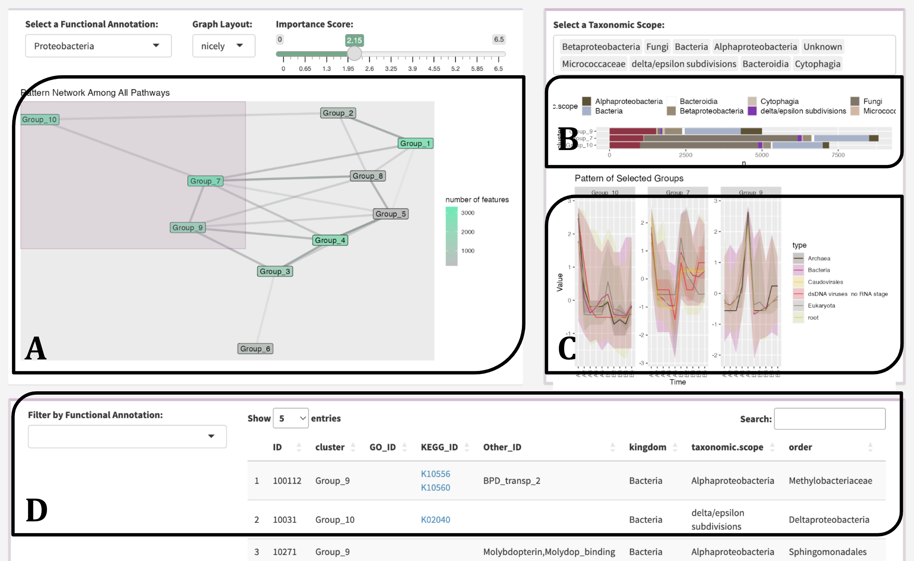
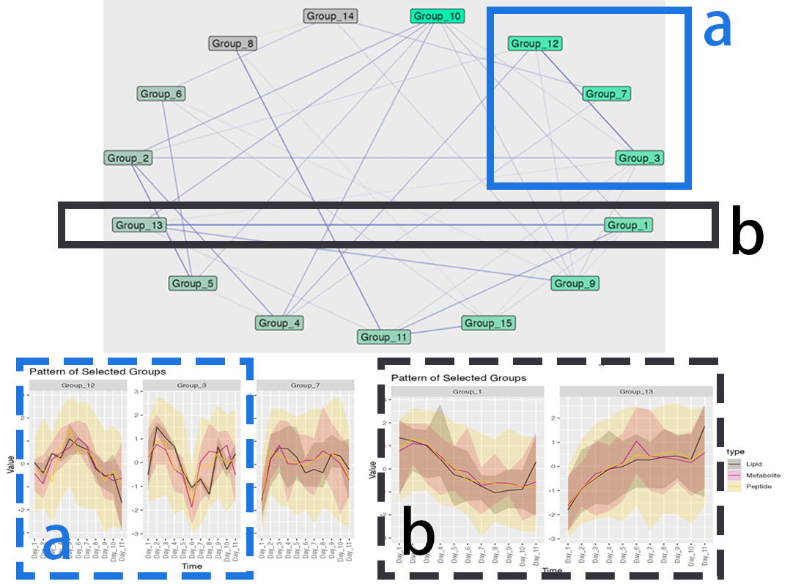

```{r, include = FALSE}
knitr::opts_chunk$set(
  collapse = TRUE,
  comment = "#>"
)
```


### Navigating the network in the MolPad dashboard follows three steps: 

1. Choose a primary functional annotation and adjust the edge density by tuning the threshold value on the importance score. Nodes that turnbright green (Fig 1.A) represent clusters containing most features in the chosen functional annotation. 

2. Brushing on the network reveals patterns of taxonomic composition (Fig 1.B) and typical trajectories  (Fig 1.C). The user could also zoom into specific taxonomic annotations by filtering.

3. View the feature table (Fig 1.D) and examine the drop-down options for other related function annotations, and then click the link for online information on the interested items. The interface is designed to support iterative exploration, encouraging the use of several steps to answer specific questions, like comparing the pattern distribution between two functions or finding functionally important community members metabolizing a feature of interest.

{ width=50% }

### Example of discoversing related patterns with network plot:

{ width=50% }

