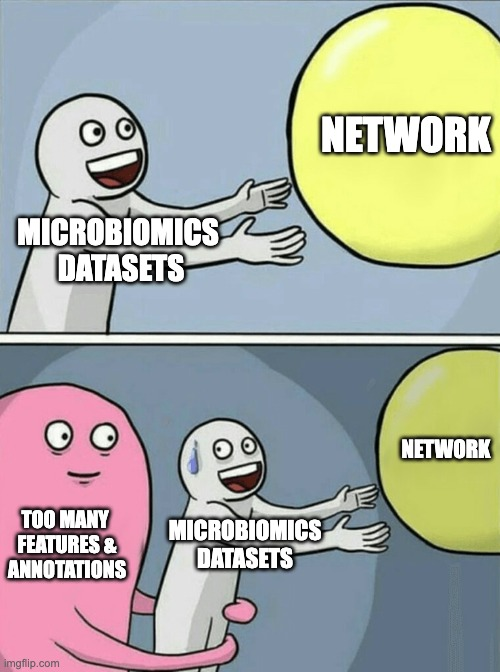
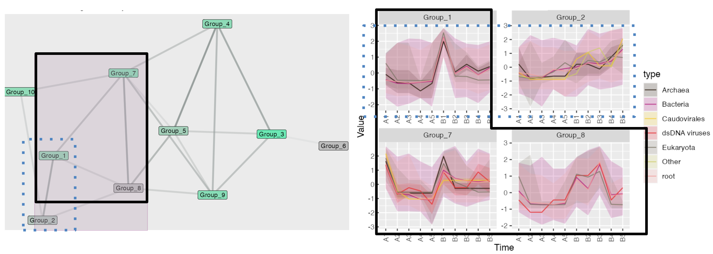

```{r, include = FALSE}
knitr::opts_chunk$set(
  collapse = TRUE,
  comment = "#>"
)
```

```{r setup, include = FALSE}
library(MolPad)
library(dplyr)
```


# Why MolPad?

With the increasing multi-omics data and longitudinal designs integrated into microbiome experiments, there is a growing need to present the network, especially with complex variations across biological modalities. Network perspective helps detect the underlying co-occurrence among microbiome samples, allowing for high-level insights into the global structure. Yet when it comes to experimental data that records time series for 100,000 features, the network will collapse into some entangled clumps and therefore unable to read. 

<br />
<center>
  
  { width=50% }
</center>

<br />
  
# Improvements

For the aim of network interpretation, MolPad shows improvements in 3 important aspects:

* Capture groups of features that share longitudinal patterns and functional properties within the network. 
* Annotate the network under complex experimental datasets, as a way to dig in specific components with notable features. 
* Streamlines exploration through modularized functions and an interactive dashboard.

This package especially facilitates the exploration of longitudinal molecular co-expression in microbiome experiments using a focus-plus-context and approach, empowering researchers to uncover global patterns and insights in longitudinal microbiomics data. 

Unlike existing tools, MolPad stands out for its rich network interactivity and support for contextualization. It is also equipped with a beginner-friendly interface and self-contained data processing functions, making it accessible to users with limited programming experience. 

<br />

# Key Features

* Trajectory clustering

By organizing data into clusters, it helps identify patterns, relationships, and underlying structures within a dataset. In essence, clustering detects groups of features or observations that behave similarly, allowing for deeper insights and more effective decision-making. 

* Network extracting

We build network between clustered trajectories by adapting the GENIE3 algorithm. Specifically, the network is learned through a series of regressions, where each cluster centroid is predicted from the expression patterns of all the other cluster centroids using random forests. We choose random forests because of their potential to model interacting features and non-linearity without strong assumptions. 

* Interactive Dashboard

This package provides an interactive dashboard designed to help users explore data and uncover relationships within complex networks. By utilizing focus-plus-context visualization, the dashboard allows users to zoom in on specific details while keeping the broader dataset in view. This approach enables a deeper understanding of the data, making it easier to identify patterns and make informed decisions. 

<br />

# What does it look like?

Now, let’s see what you can get from the dashboard. We’ll start with an overview and then demonstrate how to discover patterns within your data.


### MolPad Dashboard Overview

<center>
  
  { width=100% }
</center>
<br />


Above is the overview of the MolPad Dashboard. To explore the dashboard effectively, you can start by following the sequence A-B-C-D. This approach will guide you through the cluster-level network, taxonomic-level bar plot, type-level line plot, and feature-level table. From there, you can modify detailed settings to identify and investigate special patterns within your data.

### Discovering related patterns

<center>
  
  { width=100% }
</center>
<br />

Here is a short example of discovering related patterns using the network plot: The shade of the edges represents the proximity of nodes. In the brushed area, Groups 1-7-8 (circled by solid black lines) and Groups 1-2 (circled by blue dashed lines) are strongly linked. For Groups 1, 7, and 8, the patterns form a W-shape with a noticeable peak at the same time section. Although Group 1 shows higher volatility compared to Group 2, both groups display a highly overlapping increasing trend.

For more detailed instructions, please visit the "Get Started" page and the relevant function reference page.

